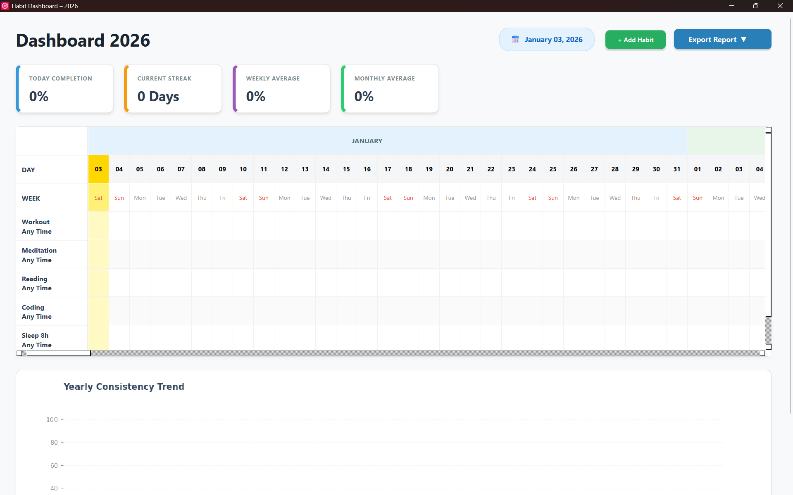

# 🎯 Data-Driven Habit Tracker (2026 Edition)


A modern, highly-interactive, and data-driven **desktop habit tracking application** built using **Python**, **PySide6 (Qt)**, and **Matplotlib**.  
The 2026 version introduces a powerful **analytics engine**, **drag-and-drop habit ordering**, **undo delete**, **dual themes**, and **professional PDF reporting**.

<p align="center">
  
</p>

---

## 📌 Table of Contents

- [✨ Features](#-features)
- [📅 Calendar System](#-calendar-system)
- [📊 Analytics Dashboard](#-analytics-dashboard)
- [🛠 Habit Management](#-habit-management)
- [🎨 Themes & UI](#-themes--ui)
- [📤 Export & Backup](#-export--backup)
- [⚙️ Installation](#️-installation)
- [🚀 Usage Guide](#-usage-guide)
- [🐞 Troubleshooting](#-troubleshooting)
- [🧱 Tech Stack](#-tech-stack)
- [📦 Project Structure](#-project-structure)
- [🤝 Contributing](#-contributing)
- [📜 License](#-license)

---

## ✨ Features

### ✔ Fully interactive habit calendar  
### ✔ Real-time KPI dashboard  
### ✔ Annual & monthly trend graphs  
### ✔ Add / Edit / Delete habits  
### ✔ Undo delete with animation  
### ✔ Light & Dark themes  
### ✔ CSV + PDF exporting  
### ✔ Backup + Restore  
### ✔ Persistent local storage  
### ✔ Drag-and-drop habit reorder  

All features update instantly with smooth animations and optimized rendering.

---

## 📅 Calendar System

The calendar is the core of the app and includes:

- Month-based grid with dynamically calculated days
- Auto-scrolls to current date on startup
- Weekends marked in red for clarity
- Today highlighted with special theming
- Prevents marking future days
- Smooth click-to-toggle habit completion
- Alternating row colors for readability
- Vertical header includes habit name + time
- Drag-and-drop reordering of habits

---

## 📊 Analytics Dashboard

### ⭐ Animated KPI Cards:
- **Today %** – Daily completion performance  
- **Best Streak** – Longest run of fully completed days  
- **Weekly Avg (%)** – Last 7 days  
- **Monthly Avg (%)** – Last 30 days  
- **Total Days Completed** – Sum for the year  

Each KPI animates smoothly for a polished experience.

---

### 📈 Annual Trend (Line + Fill Chart)

- Full-year day-by-day consistency graph  
- Dynamic shading & theme-adaptive colors  
- Month abbreviations on x-axis  
- Supports both:
  - Global overview
  - Individual habit tracking  

---

### 📊 Monthly Breakdown (Bar Chart)

- 12-month performance comparison  
- Percentage labels auto-adjust based on height  
- Theme-aware bar colors  
- Works for both global & single habit stats  

---

## 🛠 Habit Management

### ➕ Add Habit
- Add habit name + time  
- Automatically generates history for all months  

### ✏️ Edit Habit
- Hover-sensitive pencil icon  
- Update name/time anytime  

### 🗑️ Delete Habit + Undo
- Confirmation popup  
- Undo bar slides up with restore option  
- Restores name, time, and full history  

### ↕ Drag-and-Drop Reordering
- Move habits up/down  
- Syncs order across all years  
- Chart and stats auto-update  

---

## 🎨 Themes & UI

### 🌞 Light Mode
Bright, clean interface.

### 🌙 Dark Mode
High-contrast GitHub-style theme.

Everything adapts instantly:
- Calendar
- KPI cards
- Graphs
- Buttons
- Undo bar
- Containers & shadows

---

## 📤 Export & Backup

### 📄 CSV Export
Exports:
- All dates of current year  
- Each habit's daily status (Yes/No)  

### 📑 PDF Export
Includes:
- KPI summary  
- Annual graph  
- Monthly comparison chart  
- Auto-generated layout  

### 💾 Backup & Restore
- Save all data to a single JSON file  
- Restore anytime  
- Move between devices easily  

---

## ⚙️ Installation

### ✔ For Users (No Python Needed)

1. Download `HTracker.exe` from the Releases page.
2. Run the application.
3. Start tracking instantly.

---

### ✔ For Developers

Clone the repo:

```bash
    git clone https://github.com/monu754/Habit-Tracker-.git
```

Install dependencies:
```bash
    pip install PySide6 matplotlib reportlab
```

Run the app:
```bash
    python app.py
```

# 🚀 Usage Guide
## Add Habit

Use the + Habit button.
Or right-click → Edit/Delete.

## Toggle Day

Click any cell in the calendar grid.

## View Stats

Use the dropdown to switch between:

* Global Overview

* Specific habit

## Switch Theme

Click the ☀️ / 🌙 toggle button.

## Export Data

Click Export → CSV or PDF.

## Undo Delete

After deleting a habit, click UNDO on the slide-up bar.